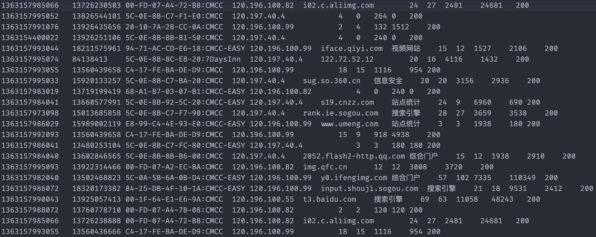
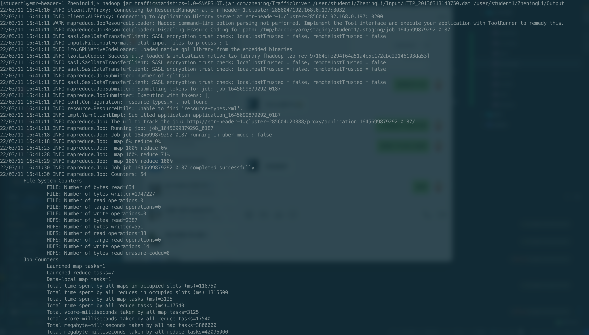
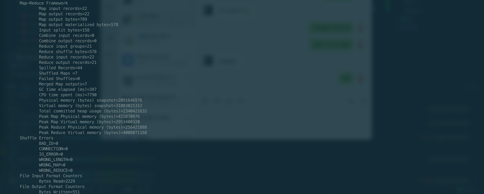
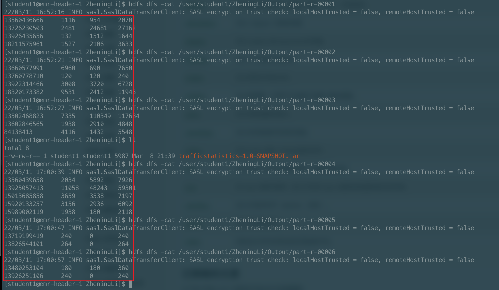
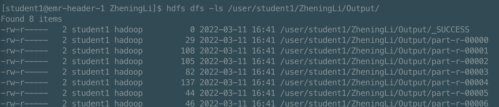

### MapReduce实践

### 需求

MapReduce编程：统计每一个手机号耗费的总上行流量、下行流量、总流量

### 数据

#### 数据准备

- 输入数据格式（以TAB分割，制表位\t）

    时间戳、电话号码、基站的物理地址、访问网址的 ip、网站域名、数据包、接包数、上行 / 传流量、下行 / 载流量、响应码

  

- 最终输出的数据格式：

  手机号码 上行流量 下行流量 总流量

### 基本思路：

- Map 阶段： 
  - 读取一行数据，切分字段。 
  - 抽取手机号、上行流量、下行流量。 
  - 以手机号为 key，bean 对象为 value 输出，即 ```context.write(手机号，bean)```。 
- Reduce 阶段：
  - 累加上行流量和下行流量得到总流量。 
  - 实现自定义的 bean 来封装流量信息，并将 bean 作为 map 输出的 key 来传输。 
  - MR 程序在处理数据的过程中会对数据排序 (map 输出的 kv 对传输到 reduce 之前，会排序)，排序的依据是 map 输出的 key。 所以，我们如果要实现自己需要的排序规则，则可以考虑将排序因素放到 key 中，让 key 实现接口：WritableComparable。 然后重写 key 的 compareTo 方法。

### 具体实现
- 流量类封装 ```TrafficBean.java```
- Map阶段 ```TrafficMap.java```
- Reduce阶段 ```TrafficReduce.java```
- 启动类 ```TrafficDriver.java```

### 运行结果

执行过程：


执行结果：


### 遇到的问题

1. 打包 jar 上传到 hadoop 服务器，执行命令：```hadoop jar trafficstatistics-1.0-SNAPSHOT.jar```，无法正常运行。显示报错需要指定 MainClass，一直不知道如何指定，
一直存在类似报错```Exception in thread "main" java.lang.ClassNotFoundException: TrafficDriver```查阅资料后，发现需要通过 Package 路径 + MainClass 名的方式。
2. 把启动命令改为了执行命令：```hadoop jar trafficstatistics-1.0-SNAPSHOT.jar /com/zhening/TrafficDriver```, 此时报错信息变为了```Exception in thread "main" java.lang.ArrayIndexOutOfBoundsException: 0```
3. 猜测是因为没有加参数，argument。即对应的输入，输出路径。 （需要注意的是，输出路径不可以先手动创建，不然会报错。还有输入文件需要先上传到hadoop文件系统，且路径需要对应上。命令改为了```hadoop jar trafficstatistics-1.0-SNAPSHOT.jar com/zhening/TrafficDriver /user/student1/ZheningLi/Input/HTTP_20130313143750.dat /user/student1/ZheningLi/Output```
4. 然后又出现了新的报错信息```Caused by: java.lang.ClassNotFoundException: Class com.hadoop.compression.lzo.LzoCodec not found```，看报错跟LZO压缩有关。StackOverflow上面说是因为lzo的jar包不存在或者没有加入到hadoop的依赖路径中。 
5. 后来也不知道怎么，同样的命令又可以运行了。 
6. 在Output目录下面看到了多个输出的文件，跟助教请教了是否都是结果。（开始还以为最终结果只有一个文件）。助教回答：输出文件数取决于 reduce task 个数，可以在代码或者提交任务的命令中通过参数修改。一般需要用户设置，跟数据量有关系，太多的话会引发小文件问题，个数太少数据量太大的话也会有性能问题。
对于作业的话，数据量较小可以设置成一个。output 应该是指你输出结果的目录。 shuffle 中间结果不在这里， 运行时的文件会在程序退出时删除掉。